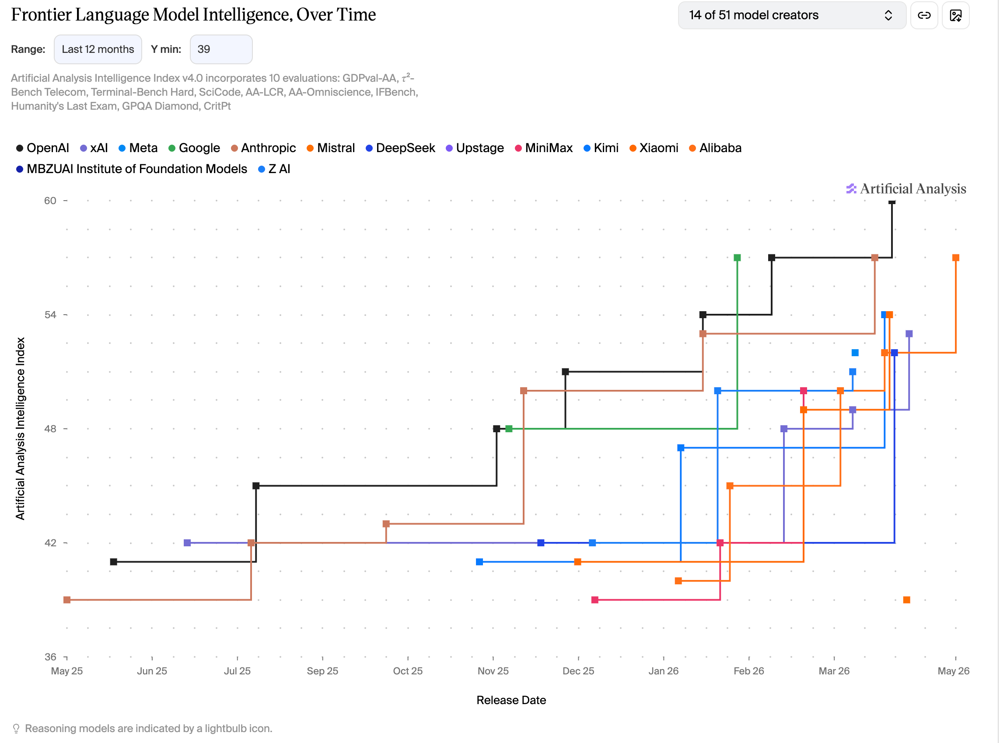

# Artificial Analysis - Frontier Chart Controls

A Tampermonkey userscript that injects local controls into the "Frontier Language Model Intelligence" chart on [Artificial Analysis](https://artificialanalysis.ai/), letting you customize the time range, Y-axis minimum, and chart height.



## Features

- **Time range filter**: All time / 12 / 9 / 6 months (defaults to Last 12 months)
- **Y-axis minimum**: Manually set the floor (default `39`) to make differences between top models easier to read
- **Chart height**: Stretched to 600px by default so the curves don't pile up
- **Recharts-aware**: Patches the internal Redux store to force the Y-axis domain, so Recharts can't silently reset it

## Install

1. Install the [Tampermonkey](https://www.tampermonkey.net/) browser extension
2. Create a new script and paste in the contents of [`artificialanalysis.js`](./artificialanalysis.js)
3. Save, then visit https://artificialanalysis.ai/. A `Range` / `Y min` control row appears right under the "Frontier Language Model Intelligence" heading.

## Customize defaults

Edit the constants at the top of the script:

```js
const CHART_HEIGHT_PX = 600;   // 0 = keep the site's default height
const DEFAULT_RANGE_IDX = 1;   // index into RANGES, 1 = Last 12 months
const DEFAULT_Y_MIN = 39;      // null = auto
```

## How it works

1. Locate the chart SVG under the heading, then walk up the React Fiber tree to find the hook holding the `creators` data and the Recharts Redux store
2. Wrap the hook's `dispatch` so every data update is re-filtered by the current Range / Y min
3. Wrap the store's `dispatch` to intercept `cartesianAxis/addYAxis` and replace its `domain` with the custom values, setting `allowDataOverflow: true`
4. Subscribe to the store and re-apply the domain whenever Recharts overwrites it
5. Patch the `ResponsiveContainer` `forwardRef` render to override its hard-coded `height` prop

## Compatibility

- Tied to Artificial Analysis's current React + Recharts implementation; site updates may break it
- Only runs on `https://artificialanalysis.ai/*`
